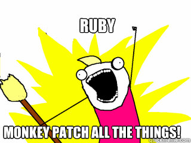

!SLIDE subsection
# Introduction à Ruby

«Ruby is designed to make programmers happy» Yukihiro Matsumoto

!SLIDE bullets incremental small
# Particularités du langage

- Perl + Lisp + SmallTalk
- Tout est objet
- Tout est expression
- Interprété et *fortement* dynamiquement typé
- Réflexif
- Orienté DSL (meta-programmation)

!SLIDE bullets small
# Tout est objet

    @@@ Ruby
    10.abs
    true.class

!SLIDE bullets small
# Tout est expression

    @@@ Ruby
    unhealthy_food = if true
      "chunky bacon"
    else
      "potatoes"
    end

!SLIDE bullets small
# Dynamiquement et fortement typé

Si ça ressemble à un canard, si ça nage comme un canard et si ça 
cancane comme un canard, c'est qu'il s'agit sans doute d'un canard.

!SLIDE bullets small
# réflexif

    @@@ Ruby
     [].respond_to?(:each)

!SLIDE bullets small
# bloc party

  @@@ Ruby
  10.times { puts "youpi" }

  10.times do 
    puts "youpi"
  end

  ["foo", "bar"].each { |s| puts s }

  # in js speak
  ["foo", "bar"].forEach(function(s) { 
    console.log (s); });

!SLIDE bullets small
# parens optionnel

  @@@ Ruby
  # exemple rspec (framework test)
  it "should work" do
    my_obj.my_method.should be_valid
  end

!SLIDE bullets small
# symbols

lightweight string (kind of...)
immutable  
une allocation en mémoire par symbol (donc comparaison rapide, key lookup)

  @@@ Ruby
  :a_symbol.object_id == :a_symbol.object_id -> true
  "a_symbol".object_id == "a_symbol".object_id -> false

!SLIDE bullets small
# structures de données avec définitions litérales

  @@@ Ruby
  my_array = [0, 1, 2]
  my_array[0]   -> 0

  hash_old_school = {:a_key => 10, :another_key => "another value"}
  hash_new_school = {a_key: 10, another_key: "another value"}
  my_hash[:a_key]   -> 10

!SLIDE bullets small
# objet

  @@@ Ruby
  class Person
  end

  p = Person.new

!SLIDE bullets small
# encapsulé, pas d'accès direct à l'état interne

  @@@ Ruby
  class Person

    def name
      @name
    end

    def name=(value)
      @name = value
    end

  end

  p = Person.new
  p.name = "pierre"
  puts p.name

!SLIDE bullets small
# la même chose 

  @@@ Ruby
  class Person
    attr_accessor :name
  end

  p = Person.new
  p.name = "pierre"
  puts p.name

!SLIDE bullets small
# single inheritance 

  @@@ Ruby
  class A
    def a
    end
  end

  class B < A
    def b
    end
  end

  B.new.a

!SLIDE bullets small
# single inheritance with mixins

  @@@ Ruby
  module MyModule
    def my_mixin
    end
  end
  class A
    include MyModule
  end

  B.new.my_mixin

!SLIDE bullets small
# monkey patching

!SLIDE bullets small
# monkey patching

  @@@ Ruby
  class String
    def palindrome?
      self == self.reverse
    end
  end

  "deified".palindrome?

!SLIDE bullets small incremental
# ruby flexible et dynamique

- dsl ready
- rails un dsl pour le web ?
