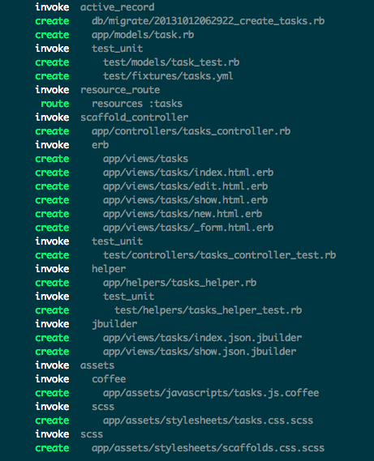

!SLIDE subsection
.notes first slide

# Notre première application Ruby on Rails 
«Let's build a TODO app!»

!SLIDE bullets small
# Génération de l'application

- Ouvrir un nouveau terminal (sous windows ouvrir "Command prompt with 
ruby on rails") et taper :

        @@@ sh
        rails new todo
        cd todo
        rails server

- Ouvrir [http://localhost:3000](http://localhost:3000)
- Pour relancer le serveur taper `CTRL + C` (`CMD + C` sous MacOSX) puis:

        @@@ sh
        rails server

!SLIDE small
.notes TODO: translate 
## Structure d'un projet rails

Source: [guide rails officiel](http://guides.rubyonrails.org/getting_started.html#creating-the-blog-application)

<table class="files">
  <thead><tr>
    <th>File/Folder</th>
    <th>Purpose</th>
  </tr></thead>
  <tbody>
    <tr>
      <td>app/</td>
      <td>
      Contains the controllers, models, views, helpers, mailers and
      assets for your application. You'll focus on this folder for the
      remainder of this guide.</td>
    </tr>
    <tr>
      <td>bin/</td>
      <td>Contains the rails script that starts your app and can contain other scripts you use to deploy or run your application.</td>
    </tr>
    <tr>
      <td>config/</td>
      <td>Configure your application's runtime rules, routes, database, and more.  This is covered in more detail in <a href="configuring.html">Configuring Rails Applications</a>
      </td>
    </tr>
    <tr>
      <td>config.ru</td>
      <td>Rack configuration for Rack based servers used to start the application.</td>
    </tr>
    <tr>
      <td>db/</td>
      <td>Contains your current database schema, as well as the database migrations.</td>
    </tr>
    <tr>
      <td>Gemfile Gemfile.lock</td>
      <td>These files allow you to specify what gem dependencies are needed for your Rails application. These files are used by the Bundler gem. For more information about Bundler, see <a href="http://gembundler.com">the Bundler website</a>
      </td>
    </tr>
    <tr>
      <td>lib/</td>
      <td>Extended modules for your application.</td>
    </tr>
    <tr>
      <td>log/</td>
      <td>Application log files.</td>
    </tr>
    <tr>
      <td>public/</td>
      <td>The only folder seen to the world as-is. Contains the static files and compiled assets.</td>
    </tr>
    <tr>
      <td>Rakefile</td>
      <td>This file locates and loads tasks that can be run from the command line. The task definitions are defined throughout the components of Rails. Rather than changing Rakefile, you should add your own tasks by adding files to the lib/tasks directory of your application.</td>
    </tr>
    <tr>
      <td>README.rdoc</td>
      <td>This is a brief instruction manual for your application. You should edit this file to tell others what your application does, how to set it up, and so on.</td>
    </tr>
    <tr>
      <td>test/</td>
      <td>Unit tests, fixtures, and other test apparatus. These are covered in <a href="testing.html">Testing Rails Applications</a>
      </td>
    </tr>
    <tr>
      <td>tmp/</td>
      <td>Temporary files (like cache, pid and session files)</td>
    </tr>
    <tr>
      <td>vendor/</td>
      <td>A place for all third-party code. In a typical Rails application, this includes Ruby Gems and the Rails source code (if you optionally install it into your project).</td>
    </tr>
  </tbody>
</table>

!SLIDE bullets small
## Génération de code (1/3)

    @@@ sh
    rails generate scaffold task title:string completed:boolean

!SLIDE bullets
## Génération de code (2/3)
Rafraîchir le browser 

Oups... :-(

!SLIDE bullets small
## Génération de code (3/3)

- La solution est dans les messages d'erreur

        @@@ Ruby
        $ rake db:migrate RAILS_ENV=development

- Rafraîchir le browser: [localhost:3000/tasks](localhost:3000/tasks)
  :-)

        @@@ Ruby
        # db/migrate/20131012094430_create_tasks.rb
        class CreateTasks < ActiveRecord::Migration
          def change
            create_table :tasks do |t|
              t.string :title
              t.boolean :completed
              t.timestamps
            end
          end
        end

!SLIDE bullets small
## CRUD RESTful

Dans le fichier `config/routes.rb` :

    @@@ ruby
    # ...
    resources :tasks
    # ...

Dans la console exécuter `rake routes` :

    @@@ sh
          Prefix Verb   URI Pattern               Controller#Action
        tasks GET    /tasks(.:format)             tasks#index
              POST   /tasks(.:format)             tasks#create
     new_task GET    /tasks/new(.:format)         tasks#new
    edit_task GET    /tasks/:id/edit(.:format)    tasks#edit
         task GET    /tasks/:id(.:format)         tasks#show
              PATCH  /tasks/:id(.:format)         tasks#update
              PUT    /tasks/:id(.:format)         tasks#update
              DELETE /tasks/:id(.:format)         tasks#destroy

Indice: `tasks#index` → `TaskController.index`

!SLIDE bullets small
## CRUD RESTful

Editons `app/controller/tasks_controller.rb` :

    @@@ Ruby 
    # GET /tasks
    # GET /tasks.json
    def index
      @tasks = Task.all
    end

Par convention, la vue sera `app/views/tasks/index.html.erb`

    @@@ html
    <!-- ... -->
    <% @tasks.each do |task| %>
      <tr>
        <td><%= task.title %></td>
        <!-- ... -->
        <td><%= link_to 'Edit', edit_task_path(task) %></td>
        <!-- ... -->
    <% end %>
    <!-- ... -->

!SLIDE bullets small
## CRUD RESTful

## Faisons pointer la racine sur la liste des tâches

Dans `config/routes.rb` ajoutons la ligne suivante entre `do` et
`end`:

    @@@ Ruby
    root "tasks#index"

!SLIDE bullets small
## CRUD RESTful

Pour mieux comprendre les interactions entre les vues et les
controlleurs, ajoutons l'affichage des paramètres de la requête 
dans le fichier `app/views/layout/application.html.erb`:

    @@@ html
    <body>
      <%= yield %>
      <%= debug(params) if Rails.env.development? %>
    </body>

