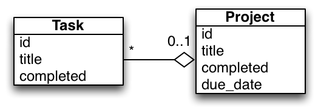

!SLIDE subsection
# 

!SLIDE bullets small
# Le M dans MVC

- Ajoutons une notion de Projet. Chaque tâche sera 
associée à un projet.
- 

Rails utilise le patron de conception (_design pattern_)
  ActiveRecord (cf. _Patterns of Enterprise Application Architecture_
  par Martin Fowler)

!SLIDE bullets small
## Ajout d'un modèle _Project_

    @@@ sh
    rails generate model project title:string \
      completed:boolean due_date:date

- La commande génère le, plutôt minimaliste, fichier
`app/models/project.rb` :

        @@@ Ruby
        class Project < ActiveRecord::Base
        end

- Une migration de la base de données est nécéssaire :

        @@@ sh
        rake db:migrate

Par convention un objet Project sera lié à une table Projects.  
La table injecte ses colonnes au modèle.

!SLIDE bullets small
## Associations (1/2)

- Rails dispose de différents types d'associations :

          @@@ Ruby
        class Task < ActiveRecord::Base

          belongs_to :project

          has_one :acceptance

          has_many :time_entry

          has_and_belongs_to_many :tag

        end

Cf. [http://guides.rubyonrails.org/association_basics.html](http://guides.rubyonrails.org/association_basics.html)

!SLIDE bullets small
## Associations (2/2)

- 
-  Pour associer chaque Tâche à un Projet modifier le fichier
   `app/models/task.rb` :

        @@@ Ruby
        class Task < ActiveRecord::Base
          belongs_to :project
        end

!SLIDE bullets small
## Rails console (le _REPL_ de Rails)

- Pour lancer la console :

        @@@ sh
        rails console
        rails console --sandbox # rollback à la sortie

- Tapons:

        @@@ Ruby
        p = Project.new
        p.title = "eat pizza"
        p = Project.new(title: "eat pizza", due_date: Date.today)
        p.save
        t = Task.new
        t.project
        t.project = p
        t.project
        t.save

- Oups...

!SLIDE bullets small
# Et si on testait ?

- Editer le fichier `test/models/taks_test.rb` :

        @@@ Ruby
        class TaskTest < ActiveSupport::TestCase
          test "add project to task" do
            task = Task.new(title: 'do it')
            task.project = projects(:one)
            task.save

            assert Task.find_by_project_id(projects(:one).id) == task
          end
        end

- Lancer les tests :

        @@@ sh
        rake test

!SLIDE bullets smaller
## De rouge à vert

- Ajoutons une colonne project_id à la table Task.
- Créer une nouvelle migration :

        @@@ sh
        rails g migration add_project_id_to_task project_id:integer

- Editer `db/migrate/*_add_project_id_to_task.rb` :

        @@@ Ruby
        class AddProjectIdToTask < ActiveRecord::Migration
          def change
            add_column :tasks, :project_id, :integer
          end
        end

- Lancer la migration :

        @@@ sh
        rake db:migrate

!SLIDE bullets
## Test d'intégration

- Nous allons utiliser Capybara.
  - Utilise Selenium
  - Simule les interactions d'un utilisateur réèl
  - Fournit un DSL simplifié

Cf. https://github.com/jnicklas/capybara  

!SLIDE bullets small
## Installation de Capybara

- Ajouter au fichier `Gemfile` :

        @@@ Ruby
        gem 'capybara', '2.1.0'

- Installer la gem :

        @@@ sh
        bundle install

- Ajouter à la fin du fichier `test/test_helper.rb` :

        @@@ Ruby
        require 'capybara/rails'
        class ActionDispatch::IntegrationTest
          include Capybara::DSL
        end

!SLIDE bullets small
.notes Expliquer le test d'intégration. Expliquer Selenium si nécéssaire
## Un test d'intégration

- Générer le fichier de test :

        @@@ sh
        rails generate integration_test task_flows

- Editer le fichier `test/integration/task_flows_test.rb` :

        @@@ Ruby
        class TaskFlowsTest < ActionDispatch::IntegrationTest
          test "new task creation has project selection" do
            p = projects(:one)

            visit(new_task_path())
            assert page.has_content?('New task')
            within("select[name='task[project_id]']") do
                option = find("option[value='#{p.id}']")
                assert_not option.nil?
                assert_equal p.title, option.text
            end
          end
        end

!SLIDE bullets small
## Faisons passer le test

Editons app/views/tasks/_form.html.erb

    @@@ html
    

      <%= f.label :project %>
      <%= f.select :project_id,
            Project.all.map {|p| [p.title, p.id]} %>
    

!SLIDE bullets small
## Le test nous permet un _refactoring_ (1/2)

On aimerait limiter les projets aux projets en cours.

- Modifier le formulaire :

        @@@ html
        

          <%= f.label :project %> 
          <%= f.select :project_id, 
                @projects.map {|p| [p.title, p.id]} %>
        

- et le contrôleur :

        @@@ Ruby
        # GET /tasks/new
        def new
          @task = Task.new
          @projects = Project.ongoing # ajouter
        end

        # GET /tasks/1/edit
        def edit
          @projects = Project.ongoing # ajouter
        end

!SLIDE bullets small
## Le test nous permet un _refactoring_ (2/2)

- et finalement le modèle.

        @@@ Ruby
        class Project < ActiveRecord::Base
          scope :ongoing, ->() do
            where("due_date > ? or due_date is null", Time.now) 
          end
        end

!SLIDE bullet small
## Exercices:
- Ecrire le test d'intégration pour la méthode `Project.ongoing`.
- Ajouter le nom du projet dans la liste des tâches (éditer
`app/views/tasks/index.html.erb`).
- Lister les tâches par projet.

!SLIDE bullets small
# Evolution du modèle (1/2)

On aimerait que les nouvelles tâches soit incomplète par défaut,
i.e. que Task.new.completed value false au lieu de NULL.

- Ajouter un test dans `test/models/task_test.rb` :

        @@@ Ruby
        test "a new task should not be completed" do
          t = Task.new
          assert t.completed == false
        end

- Lancer les tests :

        @@@ sh
        rake test

!SLIDE bullets smaller
# Evolution du modèle (2/2)

- Générer une nouvelle migration :

      @@@ sh
      rails g migration add_default_value_to_completed

- Editer `db/migrate/*_add_default_value_to_completed.rb` :

        @@@ Ruby
        class AddDefaultValueToCompleted < ActiveRecord::Migration
          def up
              change_column :tasks, :completed, :boolean, :default => false
          end

          def down
              change_column :tasks, :completed, :boolean, :default => nil
          end
        end

- Lancer la migration :

        @@@ sh
        rake db:migrate

!SLIDE bullets
# Exercices

1. Rediriger l'utilisateur sur la page de garde en cas de succès.
2. Supprimer l'édition de la complétion de la vue d'édition.

!SLIDE bullets small
## «Faciliter la tâche»

Permettre à l'utilisateur de marquer une tâche comme complète depuis 
la liste des tâches.

Au passage, enlever le boutton "show" qui n'a pas beaucoup de sens.

- Ajouter un test dans `test/integration/task_flows_test.rb`

        @@@ Ruby
        test "task index should allow user to mark task as done" do
          visit(tasks_path)
          assert page.has_link?('I did it')
        end

- Lancer les tests :

        @@@ sh
        rake test

!SLIDE bullets small
## la route

    @@@ ruby
    # routes.rb
    patch 'tasks/mark_completed/:id' => "tasks#mark_completed", \
                                  as: :mark_task_completed 

$ rake test

!SLIDE bullets small
## la vue

    @@@ ruby
    # app/views/tasks/index.html.erb
    <td><%= link_to 'I did it', mark_task_completed_path(task), \
    method: :patch %></td>

    <td><%= link_to 'Edit', edit_task_path(task) %></td>

    <td><%= link_to 'Destroy', task, method: :delete, \
     data: { confirm: 'Are you sure?' } %></td>

$ rake test

!SLIDE bullets small
## le test

    @@@ ruby
    test "task index should allow user to mark task as done" do
      task_title = "test completion"
      t = Task.create(title: task_title)
      visit(tasks_path)
      assert page.has_link?('I did it') 
      dom_element = all(:css, 'tr').last
      within(dom_element) do
          click_on('I did it')
      end
      updated_dom_element = all(:css, 'tr').last
      assert updated_dom_element.has_content?("true")
    end

$ rake test

!SLIDE bullets small
## le controlleur

    @@@ ruby
    before_action :set_task, only: [:show, :edit, :update,\
                                   :destroy, :mark_completed]
    
     ...

    def mark_completed
      respond_to do |format|
        if @task.mark_as_completed
          format.html { redirect_to tasks_path, notice: 'Task was successfully updated.' }
          format.json { head :no_content }
        else
          format.html { redirect_to tasks_path, notice: 'the task has not been marked complete' }
          format.json { render json: @task.errors, status: :unprocessable_entity }
        end
      end
    end

$ rake test

!SLIDE bullets small
## le modèle

    @@@ ruby
    class Task < ActiveRecord::Base
    belongs_to :project
      def mark_as_completed
        update(completed: true)
      end
    end

$ rake test

!SLIDE small
# Exercices

- Que se passe-t'il si une tâche est déjà complète (ne pas afficher le boutton dans ce cas par ex.)
