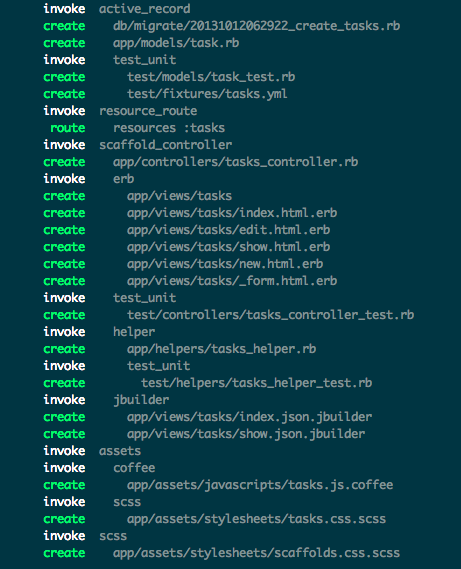

!SLIDE subsection
.notes first slide

# Notre première application Ruby on Rails 

Let's build a TODO app.

!SLIDE bullets
# Générons notre première application

    @@@ sh
    rails new todo

!SLIDE bullets
    @@@ sh
    rails generate scaffold task \
        title:string completed:boolean

!SLIDE bullets
    @@@ sh
    rails generate model project \
        title:string completed:boolean

!SLIDE bullets
Edit tests/integartion...
    @@@ sh
    rake test 
        title:string completed:boolean

!SLIDE bullets
    @@@ sh
    rails generate model project \
        title:string completed:boolean

!SLIDE bullets
Exercise: add validation to Task.title (with tests)

!SLIDE bullets
Exercise: Add task priorities

!SLIDE subsection
.notes ouvrir un compte pour les tests
# Tweet the task

!SLIDE subsection
.notes vérifier les temps/difficultés de setup
# Deploy on Heroku
 - creer un compte

!SLIDE subsection
# Push to github ?

!SLIDE subsection
.notes live coding
# Java: Deploy in torquebox
 - presentation JRuby
 - utilisation d'une librairie Java
 - service planifié
 - ...

